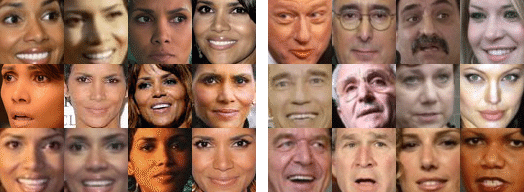

 # Facial Recognition using PCA & SVM

 | Elijah Mitchell, Devin Keller, Tyler Hanna, Colin Des Roches
 | elicmitc@iu.edu, devhkell@iu.edu, tshanna@iu.edu, cdesroc@iu.edu
 | Indiana University Bloomington
 | hid: sp20-id-0005
 | github: [:cloud:](https://github.iu.edu/ise-engr-e222/sp20-id-0005/blob/master/project/project-report/report.md)
 | code: [:cloud:](https://github.iu.edu/ise-engr-e222/sp20-id-0005/tree/master/project/project-code)

 ---

 Keywords: SVM (Support Vector Machines), Facial Recognition, PCA (Principal Component Analysis),
 Eigenfaces, Machine Learning.

 ## Abstract

Facial recognition software is a great convenience in our everyday lives; 
from our phone security to funny photo filters, we see facial recognition 
software everywhere. It is also used in much more serious matters such as
airport security and identification for law enforcement. We want to use a 
machine learning algorithm to increase the accuracy and precision of our 
facial recognition program in comparison to others. We decided to use the 
SVM (Support Vector Machines) and PCA (Principal Component Analysis) 
algorithms to identify and label faces from our initial set of data. Another 
algorithm we could have chosen is K nearest neighbors (kNN). We decided to 
use on the algorithms we did as opposed to kNN largely due to the fact that 
kNN doesn't deal with outliers in the data as easily. Being able to further 
improve the accuracy of facial recognition would benefit all who use this 
technology.

 ## Introduction

The goal of our cloud-based machine learning implementation is to download
a dataset of faces from a browser endpoint, run SVM and PCA on the training
data, and use this model to try to correctly identify the faces within the
testing set. This sort of implementation would be useful in the law enforcement
example as listed above. If a person was wanted, law enforcement could input 
pictures of this person into our algorithm to train the model, and allow the
model to try to find them on, for example, a security camera. 

This model works by extracting eigenfaces from the training data using PCA
(determines which features from the faces are most important in identification),
projecting the input data onto the eigenfaces, training the SVM classification 
model using a parameter gridseach, and predicting the names of the people in the 
test data set. More explanation of these processes and algorithms used is under the 
"The Algorithm" subheading.

 ## Background

The study of facial recognition by computers began in 1964. Early models required 
that humans determine coordinates of different features on the face, which were 
then used by the computer for recognition. It wasn't until the turn of the 21st
century that many of the models could be fully computer-based and fairly accurate.
There are many different techniques for facial recognition; including extracting 
facial features, 3-Dimensional recognition, skin texture analysis, and even 
thermal cameras nowadays. 

An advantage of facial recognition over other common biometric systems is that 
the subject doesn't have to do anything in order to be recognized. Facial 
recognition systems can be deployed in areas without most people even being aware. 
There are a few disadvantages, currently, in using facial recognition. Many systems 
are unable to work if the person is turned to the side, has a unusual facial
expression, or the lighting is different. Another negative side to using facial 
recognition in large areas is the issue of data privacy. 


 ## Data 

We used a dataset called "Labeled Faces in the Wild". This is one of the most
commonly used datasets in facial recognition. Each photo is centered on a 
single face of a famous person, and each is labeled with the name of this person.
In total, the dataset contains 13,233 target face images of 5,749 different 
individuals. Of these people, only 1,680 have two or more pictures in the dataset.
This is important to us because we need multiple pictures of each person for our 
model to work. We need roughly **say how many pics we need of each person** of a 
person to be able to accurately identify them, because we have to be able to train
the model fully. Each image is available as a 250x250 JPEG image. Most of them are
in color, but there are some that are black and white. 

The main reason we chose this dataset is the fact that these photos are captured
"in the wild". These photos are just regular pictures taken of famous people, so 
there is a large variation in the parameters such as lighting, pose, focus, 
resolution, background, and accessories. This is much more natural than most 
facial recognition datasets. Other datasets are usually photographed under strict 
conditions such that every photo is almost the same. These datasets are great for 
accurately labelling faces, but in a more practical implementation they might not 
work as well. Provided below are some examples of faces in the dataset.

You can download the dataset we used by following this link: 
[Dataset Download](http://vis-www.cs.umass.edu/lfw/lfw-funneled.tgz "Dataset Download")





 ## The Algorithm


 ### PCA

 **Talk about PCA and what it does in our project**

 


 ### SVM

 **Talk about SVM and what it does in our project**

 


 ## Results 

The table below shows the precision, recall, f1-score, and support for each of the
seven most represented people in the datset. 


|                   | precision | recall | f1-score | support |
|-------------------|-----------|--------|----------|---------|
| Ariel Sharon      | 0.75      | 0.46   | 0.57     | 13      |
| Colin Powell      | 0.79      | 0.87   | 0.83     | 60      |
| Donald Rumsfeld   | 0.94      | 0.63   | 0.76     | 27      |
| George W Bush     | 0.83      | 0.98   | 0.90     | 146     |
| Gerhard Schroeder | 0.95      | 0.76   | 0.84     | 25      |
| Hugo Chavez       | 1.00      | 0.53   | 0.70     | 15      |
| Tony Blair        | 0.97      | 0.78   | 0.86     | 36      |
| accuracy          |           |        | 0.85     | 322     |
| macro avg         | 0.89      | 0.72   | 0.78     | 322     |
| weighted avg      | 0.86      | 0.85   | 0.84     | 322     |

Precision refers to the number of True-Positives over the number of True-Positives
plus the number of False-Positives (P = Tp / Tp + Fp) collected after testing the data.
This allows you to test the ammount of accurate positive predicitions over the all of
the positive predictions. The accuracy percentages for these seven faces is fairly high
overall, with around an unweighted average of 89%. 

Recall is defined as the number of True-Positives over the number of
True-Positives plus the number of False-Negatives (R = Tp / Tp + Fn) or, the amount
of accurate positive predictions over all all of the actual true results. Recall in this
case is slightly lower than accuracy with an average of only 72%, which makes sense given
the high accuracy rating.

The F1 score is refered to as the "harmonic mean of precision and recall"
(F1 = 2 x (PxR / P+R)), and is essentially a simple measure of the tests accuracy overall,
as it takes all predicitions and actual results into account. Here, a score of .78 is an
average score (of course the closer to 1.0 the better for an F1 score). This could be an
indication that some of the faces were overtly difficult to distinguish when compared to
other faces in the dataset.

The Support is defined as the number of occurences of each class in the y_true parameter,
or the set of all actual target values for the dataset.


 ## Implementation

 ### REST

This implementation of our machine learning algorithm is made possible through REST
API. REST is an acronym for **RE**presentational **S**tate **T**ransfer. This 
architecture provides standards between the many computer systems that exist,
which makes it easier for them to communicate between each other. The main
characteristics of these RESTful systems are the facts that they are stateless
and separate the client and server. Stateless means that the client does not need 
to know anything about the state of the server and vice versa. Because of this, 
clients and servers are able to understand each other quickly and reliably. The
separation of client and server is important because it enables the client to
change code without interrupting how the server operates. 

REST takes in four basic commands called CRUD commands. These stand for Create,
Read, Update, & Delete. These are followed by a header and a path to a resource 
(any object the API can provide information about). The CRUD commands are then
translated to the 4 basic HTTP verbs: POST, GET, PUT, & DELETE, respectively. The
command is then sent to the server which will return a response code indicating
whether the was successful or not. 


 ### Endpoints

Our application utilizes 4 endpoints in exchange between the client and server. 
This exchange is specified in te master.yaml file. As shown in the yaml file, all
of the endpoints are on the 'http://localhost:8080/final' server, so that is the
start of each endpoint when entering it in the browser. 

The '/data/saveas/output' endpoint downloads the data from the downloadable link 
inside of url.txt. This download should take a minute because the file of faces 
is relativey large. The second endpoint '/general_info/filename/filename' 
describes some general information about the dataset. Third, 
'/experiment/svm/filename/filename/train/trainingSize' runs our PCA and SVM 
algorithm on the dataset. This endpoint allows the user to specify the training 
size. In general, 80% is what most algorithms use for the training size. The last 
endpoint, '/experiment/cof_matrix/filename/filename' plots the coeficient matrix 
and returns the table shown above in the results section.


 ### Dockerfile & Makefile

The Dockerfile is an important aspect for hosting our application on a server. 
Docker allows you to containerize an application, which makes it much more
lightweight and portable. Containers allow you to deploy your code and all of
it's dependencies as a single package. Our dockerfile has simple commands to 
import all of the necessary python packages, libraries, and also our code. 

Our Makefile simplifies the process of running our application through Docker. 
Running the command "make docker-all" tells the computer to build the Docker 
container and start the server that we can run the endpoints on. In contrast, 
you would have to type "docker build --no-cache --pull -t 
sp19-222-101/spam:latest ." followed by "docker run -t -p 8080:8080 
sp19-222-101/spam" if there weren't a Makefile. 


 ## Specification
 ```
 openapi: 3.0.0
info:
  version: "0.0-oas3"
  title: lab5 get data demo
  description: A simple service to get data from a cloud storage service
  termsOfService: 'http://swagger.io/terms/'
  contact:
    name: REST Service Example to get data
  license:
    name: Apache
paths:
  /data/saveas/<output>:
    get:
      tags:
        - DATA
      operationId: py_scrips.gatherData.download
      description: Downloads data from url
      responses:
        '200':
          description: Data info
          content:
            application/json:
              schema: {}
  /general_info/filename/<filename>:
    get:
      tags:
        - DATA
      operationId: py_scrips.svm.info
      description: describes the general info about dataset
      responses:
        '200':
          description: Data info
          content:
            application/json:
              schema: {}
  /experiment/svm/filename/<filename>/train/<trainingSize>:
    get:
      tags:
        - DATA
      operationId: py_scrips.svm.svm_gen
      description: trains and tests data
      responses:
        '200':
          description: Data info
          content:
            application/json:
              schema: {}
  /experiment/cof_matrix/filename/<filename>:
    get:
      tags:
        - DATA
      operationId: py_scrips.svm.gen_cof_mat
      description: plots coef matrix
      responses:
        '200':
          description: Data info
          content:
            application/json:
              schema: {}

servers:
  - url: 'http://localhost:8080/final'

 ```

 ## Conclusion

Our application of a machine learning facial recognition software showed that it 
served its purpose. When using the dataset "Labeled Faces in the Wild" our
implementation using PCA and SVM had roughly an 85-90% accuracy in predicting
names based on faces. The recall and f1-scores varied by a decent amount depending
on the person, but they were still generally in the 70-80% range which is pretty
good for a simple model. Our model worked better at correctly identifying people
who had many photos in the dataset, which makes sense becuase the model is able to
train on more instances. 

Currently, our model only works by hard coding in a link to the dataset we would 
like to use, but this might be a way we could improve our model. Ideally, our model
could constantly take in faces from outside sources such as photo databases or 
security cameras. This would make the model much more useful in practice, but also
much more complicated. Another way we might improve this model in the future is by
taking user input on which person in the dataset they want to search for. This 
would allow the law enforcement example to be much more effective because they can
just search for a specific name and the model should be more efficient.

